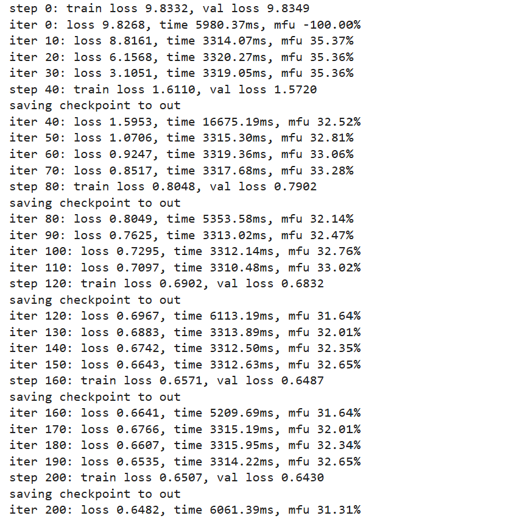
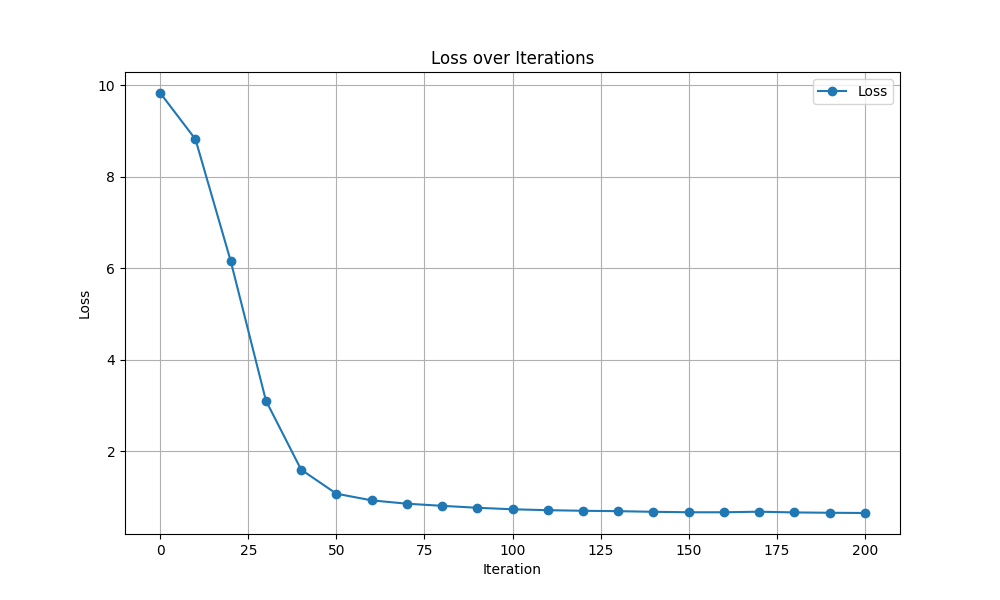
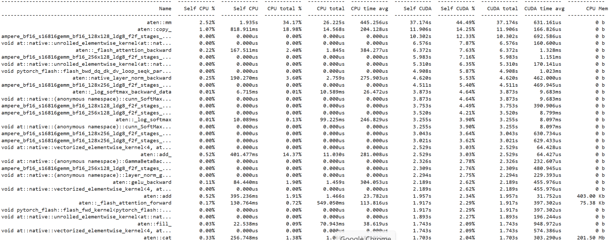

# nanoGPT

This is a repository for training a one-layer GPT2 model that predicts a distribution of 0 and 1. It is modified from [nanoGPT](https://github.com/karpathy/nanoGPT). When running on a single A100 40GB GPU, the loss converges in 20 minutes. The training code is in `train.py`.


## install

```
pip install torch numpy transformers datasets tiktoken wandb tqdm
```

Dependencies:

- [pytorch](https://pytorch.org) <3
- [numpy](https://numpy.org/install/) <3
-  `transformers` for huggingface transformers <3 (to load GPT-2 checkpoints)
-  `datasets` for huggingface datasets <3 (if you want to download + preprocess OpenWebText)
-  `tiktoken` for OpenAI's fast BPE code <3
-  `wandb` for optional logging <3
-  `tqdm` for progress bars <3

## dataset generation
The dataset and dataset generation code is located in `data/zero_one` folder.

To prepare the dataset: 
``` 
python data/zero_one/prepare.py 
```

The code uses random number generator to generate 10000 sequences of 1000 words consisting of 0 and 1, which have probablility of 1/3 and 2/3 respectively. This part of the code takes 2.55 seconds.

Then, the code uses huggingface datasets library to tokenize the dataset and then encode each token with GPT-2 encoding. It then loads the encoded dataset into training and validation datasets, train.bin and val.bin respectively. This part of the code takes 6.20 seconds.

## training

To train the model:
```
!python train.py config/train_gpt2.py --compile=False --dataset=zero_one
```

The total training time until loss convergence is 73902.72 ms. Evaluation calculation of validation loss happens every 40 iterations. Below is the output of time, loss, and mfu associated with iterations and steps. The final evaluation's validation loss is 0.6430.



The loss converges after 150 iterations at loss=0.6643. Below is the loss graph:


## Optimizations
I changed the batch size from 4 to 64 and set block size to 512 to fully utilize the VRAM of A100. The peak GPU memory consumption is 26 GB. 

I also experimented with different combinations of batch size and block size that product to the same number tokens (512*64), but no variation is observed in iterations to converge. This makes sense since our sequence to predict is very simple and it can be learned easily without much tuning.

Another optimization that could be applied is to reduce the amount of evaluations on validation dataset. As shown in output in training section, the iterations right after evaluation takes the longest. This is resulted from the context switching between evaluation and training modes.

## profiling results
I used pytorch profiler to profile the amount of CPU and GPU time that each low level routine takes. Below is top 32 routines from the result that consumed the most GPU time:



From the profiling result we can see that routines that consumed the most GPU(CUDA) times are matrix multiplication (aten::mm, ampere...), tensor copy(aten::copy), flash attention, and elementwise operations (at::native::unrolled_elementwise_kernel, at::native::vectorized_elementwise_kernel, and activation function routines)
