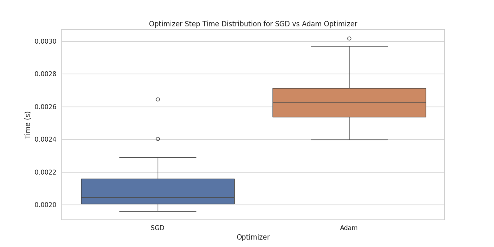
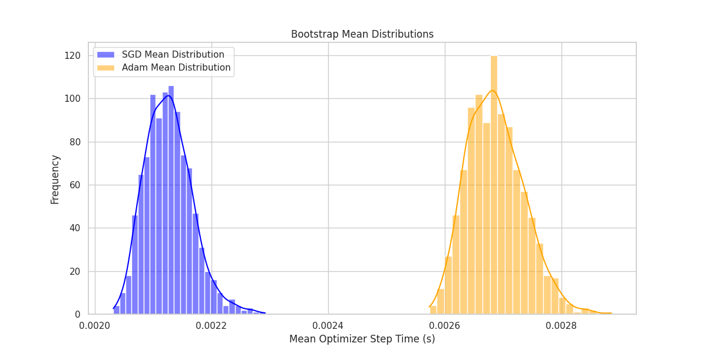

# Optimizer Performance Comparison 

This is a repository for profiling the performance of different optimizers for training a one-layer GPT2 model that predicts a distribution of 0 and 1, which have probablility of 1/3 and 2/3 respectively. Specifically, the step time for each optimizer is measured and compared.


## install

```
pip install torch numpy matplotlib seaborn lightning
```

Dependencies:

- [pytorch](https://pytorch.org) <3
- [numpy](https://numpy.org/install/) <3
-  `matplotlib` 
-  `seaborn` 
-  `lightning` 


## Usage
```
python3 lightning_train.py
```

## Methodology

### Dataset and Model

- **Dataset**: A custom dataset was created (`GenerateDataset`) where each sequence represents a series of coin flips with a probability of heads set to 0.666. The dataset includes 1000 samples with each sequence having a length of 10 flips. The dataset is generated on the fly every time when a batch is requested.

- **Model**: A simplified version of a transformer model (`GPT2`) with nanoGPT was used. The model only contains 1 layer for fast training.

### Optimizer Comparison

- **SGD**: Known for its simplicity, SGD updates parameters based on the gradient of the loss function for each mini-batch.
- **Adam**: An adaptive learning rate method that computes individual learning rates for different parameters from estimates of the first and second moments of the gradients.

### Training Procedure

- The model was trained for one epoch using both SGD and Adam optimizers with identical learning rates.
- The time taken for the optimizer step operation was measured for each optimizer over all iterations.

### Data Analysis

- **Timing Data**: The time taken for optimizer to step for an iteration was recorded for each optimizer during training.
- **Bootstrap Resampling**: To estimate the distribution of mean times, bootstrap resampling was performed 1000 times for each optimizer's timing data.

### Visualization

- **Box Plot**: Showcased the distribution of times for each optimizer, highlighting central tendency and variability.
- **Bootstrap Distribution**: A histogram was created to visualize the distribution of mean times from bootstrap resampling, allowing for comparison between SGD and Adam.
- **Time Diff Plot**: A histogram shows the distribution of SGD time - Adam time, which allows a more strightforward way to compare the difference between SGD and Adam.


## Profiling Results
- **Unoptimized Total Time for each Operation (Adam)**: 
  

- **Step Time Difference Plot**: 
  
  The plot indicated that:
  - The time difference between SGD and Adam is negative, so SGD is faster than Adam to perform an optimizer step.

- **Box Plot**: 
  
  The box plot indicated that:
  - SGD has lower standard deviation and lower median than Adam

- **Bootstrap Analysis**: 
  
  The bootstrap distributions showed:
  - The results match our conclusion from the time diff plot. SGD generally faster than Adam.


## Conclusion
SGD is proved to be faster per iteration as compared to Adam due to its simplicity as expected. SGD also has higher consistency as compared to Adam. However, its total training time might be longer if more iterations are needed for convergence.